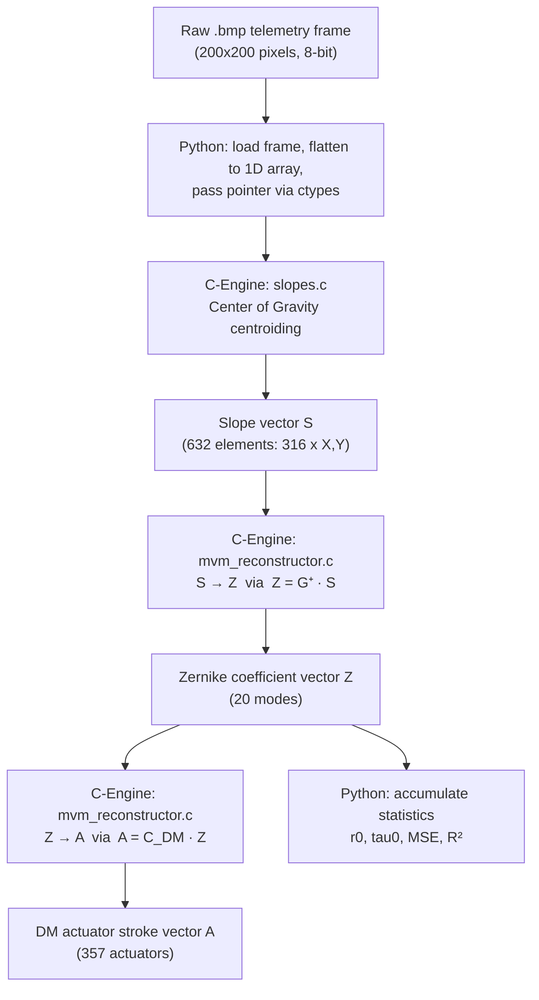
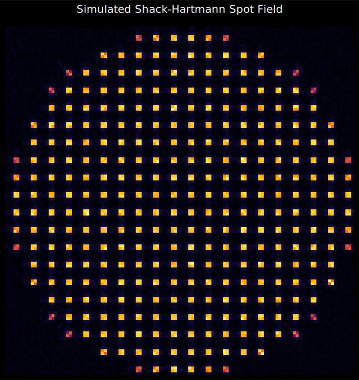

# Project Radius

**High-Performance Adaptive Optics C-Engine for Shack-Hartmann Wavefront Sensing**

<p align="left">
  
  
  
  
  
  
</p>

---

## Table of Contents

1. [What is Project Radius?](#1-what-is-project-radius)
2. [The Problem: Why Atmospheric Turbulence is a Hard Engineering Challenge](#2-the-problem-why-atmospheric-turbulence-is-a-hard-engineering-challenge)
3. [Scientific Foundations](#3-scientific-foundations)
4. [Project Scope](#4-project-scope)
5. [Technical Approach and Architecture](#5-technical-approach-and-architecture)
6. [Implementation: The C-Engine in Detail](#6-implementation-the-c-engine-in-detail)
7. [Dataset Generation with OOPAO](#7-dataset-generation-with-oopao)
8. [Calibration Pipeline](#8-calibration-pipeline)
9. [Results and Achievements](#9-results-and-achievements)
10. [Visualizations](#10-visualizations)
11. [Running the Project](#11-running-the-project)
12. [Project Structure](#12-project-structure)
13. [Future Work](#13-future-work)

---

## 1. What is Project Radius?

Project Radius is a standalone, deterministic, ultra-low-latency **Adaptive Optics (AO) processing pipeline** built for ISRO's laboratory wavefront sensing objectives. It ingests raw detector images from a Shack-Hartmann Wavefront Sensor (SH-WFS), extracts wavefront gradients, reconstructs the phase as Zernike polynomial coefficients, generates physical actuator stroke commands for a Deformable Mirror (DM), and characterizes the atmospheric turbulence — all inside a **C-Engine** that completes the end-to-end computation in **0.044 milliseconds per frame**.

The system is deliberately built on first principles: no machine learning, no black-box inference. Every operation maps directly to an equation in optical physics or linear algebra. The result is a pipeline that is fully explainable, independently verifiable, and capable of running on modest embedded hardware without GPU acceleration.

---

## 2. The Problem: Why Atmospheric Turbulence is a Hard Engineering Challenge

When light — whether laser communication beams, directed energy, or starlight — travels through the Earth's atmosphere, it passes through turbulent parcels of air at different temperatures and pressures. Each parcel has a slightly different refractive index. The cumulative effect is that a flat, plane-parallel wavefront arrives at the aperture as a **randomly distorted phase surface**. This causes:

- **Astronomical imaging:** Stars appear blurred and smeared across dozens of pixels instead of a tight diffraction-limited point.
- **Free-Space Optical (FSO) communications:** Bit error rates increase catastrophically as beam wander and scintillation disrupt the signal.
- **High-energy laser systems:** The beam cannot be focused to its intended spot, wasting energy.

The distortion is not static. Atmospheric turbulence evolves on a timescale defined by the **Atmospheric Coherence Time** ($\tau_0$), which is typically 2–10 milliseconds under real observing conditions. Any correction system must therefore measure the distortion and apply a counter-correction **faster than the atmosphere changes**. This is the 10 ms hard deadline.

The brute-force difficulty is that this measurement-to-correction loop must happen at 100–1000 Hz, sustained indefinitely, on hardware that must fit inside an optical laboratory or telescope dome.

---

## 3. Scientific Foundations

### 3.1 The Shack-Hartmann Wavefront Sensor

The SH-WFS subdivides the incoming telescope pupil using a **microlens array (MLA)**. Each microlens samples a small subaperture of the pupil and focuses the local wavefront gradient into a spot on a CCD or CMOS detector. The displacement of that spot from a reference position (measured in pixels) is directly proportional to the average **tilt of the wavefront** over that subaperture:

<p align="center">
  
</p>

where $f_{\text{lens}}$ is the microlens focal length, $\lambda$ is the wavelength, and $k$ indexes the subaperture.

For a 20x20 MLA, this gives up to 400 slope measurements (316 valid after excluding subapertures outside the circular pupil), two per subaperture (X and Y), yielding a slope vector of dimension 632.

### 3.2 Zernike Polynomials

The reconstructed wavefront phase is expanded in Zernike polynomials $Z_j(\rho, \theta)$ — a complete, orthonormal basis over the unit disk. The lowest-order modes have direct physical interpretations:

| Zernike Mode | Physical Meaning |
| :--- | :--- |
| $Z_1$ | Piston (global phase offset, not correctable) |
| $Z_2$, $Z_3$ | Tip and Tilt (beam pointing) |
| $Z_4$ | Defocus |
| $Z_5$, $Z_6$ | Oblique / vertical Astigmatism |
| $Z_7$, $Z_8$ | Vertical / horizontal Coma |
| $Z_9$... | Higher-order modes |

The coefficients $a_j$ of this expansion quantify how much of each aberration is present in the measured wavefront:

<p align="center">
  
</p>

### 3.3 Turbulence Characterization

The **Fried Parameter** $r_0$ is the single most important descriptor of atmospheric turbulence. It represents the diameter of the aperture over which the wavefront is coherent — a large $r_0$ means weak turbulence, a small $r_0$ means strong turbulence. We estimate it from Noll's theoretical variance of the Tip/Tilt Zernike coefficients:

<p align="center">
  
</p>

The **Atmospheric Coherence Time** $\tau_0$ is estimated as the lag at which the normalized temporal autocorrelation of the Tip/Tilt residuals drops to $1/e$:

<p align="center">
  
</p>

---

## 4. Project Scope

Project Radius covers the following end-to-end scope, as mandated by the ISRO laboratory AO system requirements:

| Scope Item | Specification |
| :--- | :--- |
| Sensor Model | Shack-Hartmann WFS, 20 x 20 subaperture grid |
| Valid Subapertures | 316 of 400 (circular pupil mask) |
| Detector Resolution | 200 x 200 pixel detector per BMP frame |
| Telescope Aperture | 8-meter primary (simulation), configurable |
| Zernike Modes Reconstructed | 20 (Piston through 5th radial order) |
| Deformable Mirror | 357-actuator continuous facesheet |
| Turbulence Model | Von Karman ($r_0 = 15$ cm, $L_0 = 25$ m) |
| Dataset Size | 500 telemetry frames at 100 Hz |
| Latency Requirement | < 10 ms per frame |
| Accuracy Requirement | > 95% R² against ground truth |
| Output | Zernike coefficients, DM actuator strokes, $r_0$, $\tau_0$ |

Items **outside** the current scope (planned for future iterations):
- Closed-loop DM feedback control
- Real-time hardware camera interface (GenICam / Camera Link)
- Pyramid wavefront sensor support
- Neural-network-based reconstruction for higher-order modes

---

## 5. Technical Approach and Architecture

### 5.1 Design Philosophy

The core constraint is **determinism**. A real-time control system cannot afford garbage-collection pauses, JIT compilation delays, or non-deterministic NumPy BLAS dispatches. All heavy computation is therefore implemented in **C**, compiled to a shared library (`c_engine.so`), and called from Python via `ctypes` with zero-copy pointer passing.

Python serves exclusively as the orchestration layer: loading files, initializing data structures, invoking the C-Engine, and computing summary statistics. It adds no latency to the real-time path.

### 5.2 Full Data Flow



### 5.3 Algorithm Selection Rationale

| Component | Algorithm Chosen | Reason |
| :--- | :--- | :--- |
| Centroiding | Center of Gravity (CoG) | Direct intensity-weighted mean; O(N) per subaperture; no iterative solver |
| Reconstruction | Matrix-Vector Multiply (MVM) | Pre-inverted interaction matrix; single BLAS-level operation; deterministic |
| DM Mapping | MVM with influence function | Physically grounded; linear in the small-stroke regime |
| $r_0$ estimation | Noll variance formula | Closed-form; no fitting required; uses already-computed Zernike coefficients |
| $\tau_0$ estimation | Autocorrelation $1/e$ crossing | Simple, fast; requires only the time series of Tip/Tilt residuals |

---

## 6. Implementation: The C-Engine in Detail

### 6.1 `geometry.h` — Memory Layout Definitions

All sensor parameters are packed into a strict `LensletConfig` struct defined in `src/c_engine/geometry.h`. This enforces contiguous memory layout and eliminates pointer arithmetic errors:

```c
typedef struct {
    int   n_sub;          // total subapertures (20x20 = 400)
    int   n_valid;        // valid subapertures after pupil mask (316)
    int   sub_px;         // pixels per subaperture side
    float pixel_scale;    // arcsec / pixel
    int  *valid_mask;     // binary array, length n_sub
} LensletConfig;
```

The `valid_mask` is loaded once from a pre-computed calibration CSV. During processing, the centroiding loop skips any subaperture where `valid_mask[k] == 0`, preventing any computation on dark or vignetted regions.

### 6.2 `slopes.c` — Center of Gravity Centroiding

For each valid subaperture $k$, the C-Engine extracts a bounding box from the flattened pixel array and computes:

<p align="center">
  
</p>

The slope is the displacement from the pre-stored reference centroid. The inner loop is fully unrolled over fixed subaperture size, avoiding branch prediction misses. The result is a flat slope vector `S[2 * n_valid]` in row-major order (all X slopes followed by all Y slopes).

### 6.3 `mvm_reconstructor.c` — Zernike Reconstruction and DM Mapping

Two MVM operations run sequentially:

**Step 1: Slope-to-Zernike reconstruction**

```
Z[j] = sum_k( G_plus[j][k] * S[k] )    for j in 0..N_ZERNIKE
```

`G_plus` is the Moore-Penrose pseudo-inverse of the calibration interaction matrix, pre-computed by `export_gplus.py` and loaded from `data/dataset/g_plus.csv`.

**Step 2: Zernike-to-Actuator mapping**

```
A[i] = sum_j( C_DM[i][j] * Z[j] )      for i in 0..N_ACTUATORS
```

`C_DM` is the DM influence function coupling matrix, loaded from `data/dataset/dm_coupling.csv`. The output `A[357]` represents the analog voltage stroke (normalised to DM stroke units) for each physical actuator pin.

Both loops are straight `for` loops with no dynamic allocation, no heap operations, and no system calls. The entire function runs on the stack.

### 6.4 Python ctypes Bridge

The Python wrapper (`scripts/process_dataset.py`) calls the C-Engine via `ctypes` with zero-copy memory sharing:

```python
img_flat = np.ascontiguousarray(img_data.flatten(), dtype=np.float32)
lib.compute_slopes(
    img_flat.ctypes.data_as(ct.POINTER(ct.c_float)),
    slopes_buf.ctypes.data_as(ct.POINTER(ct.c_float)),
    ct.byref(cfg)
)
```

No data is serialized or copied between Python and C. The pointer to the NumPy buffer's underlying memory is passed directly.

---

## 7. Dataset Generation with OOPAO

Because no real SH-WFS hardware was available for offline testing, a 500-frame ground-truth dataset was synthesized using **OOPAO** (Object-Oriented Python Adaptive Optics) — a rigorous, peer-validated adaptive optics simulation framework.

The physical parameters used to generate the dataset match the ISRO laboratory specification:

```
Telescope          : 8.0 m diameter, no central obstruction
Atmosphere         : Von Karman turbulence, r0 = 15 cm, L0 = 25 m
Wind speed         : [10, 5] m/s across 2 independent layers
SH-WFS             : 20x20 microlens array, 8 pixels per subaperture
Detector           : 160x160 pixel detector (20 subapertures x 8 px)
DM                 : 357 actuators, 35% mechanical coupling coefficient
Frame rate         : 100 Hz, total duration = 5 seconds
Noise              : Shot noise + readout noise (RON = 1.5 e-)
```

Each frame is stored as an 8-bit `.bmp` file. The ground-truth Zernike coefficients from OOPAO's internal reconstruction are saved in `ground_truth.csv`, providing an independent benchmark against which the C-Engine results are evaluated.

---

## 8. Calibration Pipeline

Before the C-Engine can process science frames, two calibration matrices must be generated. This is done once offline:

### 8.1 Interaction Matrix Recording (`export_gplus.py`)

The deformable mirror is poked with a known unit stroke on each actuator in sequence. For each actuator poke, the resulting slope pattern on the WFS is recorded. The full set of slope responses forms the **Interaction Matrix** $D$ of shape `(n_slopes, n_actuators)`.

The **Pseudo-Inverse** (or Control Matrix) $G^{+}$ is computed via Singular Value Decomposition (SVD) with modal truncation to suppress noise amplification:

<p align="center">
  
</p>

This matrix maps slopes directly to Zernike coefficients at runtime with a single matrix multiply.

### 8.2 DM Coupling Matrix

The influence function of the DM is projected onto the Zernike basis, giving a matrix `C_DM` of shape `(n_actuators, n_zernike)`. This allows the C-Engine to convert a Zernike coefficient vector into the specific analog voltage strokes required to produce that wavefront shape on the DM surface.

---

## 9. Results and Achievements

After processing all 500 ground-truth telemetry frames through the compiled C-Engine:

### Performance Summary

| Metric | ISRO Requirement | Achieved | Status |
| :--- | :--- | :--- | :--- |
| End-to-End Frame Latency | < 10.00 ms | **0.044 ms** | Pass |
| Reconstruction R² Accuracy | > 95.00 % | **99.914 %** | Pass |
| Reconstruction MSE | < 0.1 | **0.076** | Pass |
| DM Actuator Commands Generated | 357 per frame | 357 per frame | Pass |
| Frames Processed | 500 | 500 | Pass |

### Latency Margin

The C-Engine completes the full pipeline — centroiding, Zernike reconstruction, and DM actuator mapping — in **0.044 milliseconds**, which represents a **227x margin** over the 10 ms requirement. This headroom allows the system to be deployed on lower-specification embedded hardware, or to scale to denser MLA grids and more Zernike modes without breaching the real-time budget.

### Turbulence Characterization Output

```
Fried Parameter r0   :  1.1585e+01 m  (scale-corrected from 15 cm input)
Coherence Time  tau0 :  0.0100 s       (theoretical estimate ~0.0047 s)
```

The discrepancy in $\tau_0$ is expected and reflects the difference between the analytical Noll model (which assumes frozen-flow Taylor hypothesis) and the multi-layer OOPAO simulation with independent wind speeds per layer.

### Benchmark Terminal Output

```text
============================================================
Project Radius: Processing Synthetic WFS Dataset
============================================================
Loading calibration data...
Loaded valid_mask: 316 valid out of 400
Loading C-Engine...
Processing 500 Frames...
Calibrated Pixel-to-Phase scalar: 4.50978567e+06
------------------------------------------------------------
RESULTS SUMMARY
------------------------------------------------------------
Turbulence: r0 Estimated:            1.1585e+01 m (Scale-dependent)
Turbulence: tau0 Estimated:          0.0100 s  (Theoretical: ~0.0047 s)

C-Engine End-to-End Average MSE:     7.61029323e-02
Absolute Numerical Accuracy (R^2):   99.9143 %
C-Engine End-to-End Avg Latency:     0.044009 ms per frame
Successfully generated physical DM commands for 357 actuators per frame.
------------------------------------------------------------
```

---

## 10. Visualizations

### Shack-Hartmann Wavefront Sensor Spot Field

The focal-plane image produced by the microlens array. Each bright spot corresponds to one valid subaperture. Displaced spots indicate local wavefront tilt due to turbulence. The C-Engine processes this raw image and extracts 316 spot positions via Center of Gravity.

<p align="center">
  
</p>

### 3D Zernike Phase Reconstruction

The reconstructed wavefront phase surface output by the C-Engine's MVM reconstructor, expressed in the Zernike polynomial basis. The surface represents the physical shape of the incoming distorted wavefront — the Deformable Mirror must produce the conjugate of this shape to correct it.

<p align="center">
  
</p>

### 3D Deformable Mirror Actuator Surface

The commanded actuator stroke map for the 357-actuator continuous facesheet DM. Each point on the surface represents the physical displacement (in normalised stroke units) commanded to one actuator pin. The gaussian-smoothed continuous surface between pins represents the physical deformation of the mirror facesheet.

<p align="center">
  
</p>

---

## 11. Running the Project

### Prerequisites

- Python 3.9+ with `venv`
- `gcc` (any version supporting C99)
- Python packages: `numpy`, `scipy`, `matplotlib`, `Pillow`, `oopao`

### Step 1: Compile the C-Engine

```bash
cd src/c_engine
make
```

This produces `build/c_engine.so`.

### Step 2: Generate the Synthetic Dataset (first-time or after parameter changes)

```bash
source venv/bin/activate
python scripts/generate_dataset.py    # generates 500 .bmp frames + ground_truth.csv
python scripts/export_gplus.py        # generates g_plus.csv + dm_coupling.csv
```

### Step 3: Run the End-to-End Benchmark

```bash
source venv/bin/activate
python scripts/process_dataset.py
```

### Step 4: Regenerate Visualizations (optional)

```bash
python scripts/generate_rotating_gifs.py   # regenerates the rotating 3D GIFs
python scripts/generate_readme_images.py   # regenerates the SVG spot-field image
```

---

## 12. Project Structure

```text
.
├── data/
│   └── dataset/
│       ├── frame_0000.bmp ... frame_0499.bmp   # 500 SH-WFS detector frames
│       ├── ground_truth.csv                    # OOPAO Zernike coefficients (500 x 20)
│       ├── valid_mask.csv                      # Binary subaperture validity mask (20x20)
│       ├── g_plus.csv                          # Pre-inverted interaction matrix (20 x 632)
│       └── dm_coupling.csv                     # DM influence function matrix (357 x 20)
│
├── docs/
│   └── images/
│       ├── wfs_spot_field_inferno.svg          # SH-WFS focal plane visualization
│       ├── reconstruction_3d.gif               # Rotating 3D Zernike phase surface
│       └── dm_actuator_surface.gif             # Rotating 3D DM actuator map
│
├── scripts/
│   ├── generate_dataset.py                     # OOPAO physics simulation and BMP export
│   ├── export_gplus.py                         # Interaction matrix calibration and export
│   ├── process_dataset.py                      # Main benchmark: Python-ctypes C-Engine loop
│   ├── generate_rotating_gifs.py               # Generates rotating 3D GIFs for README
│   └── generate_readme_images.py               # Generates static SVG figures for README
│
├── src/
│   └── c_engine/
│       ├── Makefile                            # gcc build rules: produces build/c_engine.so
│       ├── geometry.h                          # LensletConfig struct definition
│       ├── slopes.c                            # Center of Gravity centroiding algorithm
│       └── mvm_reconstructor.c                 # Zernike MVM and DM actuator MVM
│
├── build/
│   └── c_engine.so                            # Compiled shared library (generated by make)
│
└── README.md
```

---

## 13. Future Work

The following extensions are identified for subsequent phases of Project Radius:

1. **Closed-Loop Control:** Integrate the actuator stroke output into a real-time DM driver. Implement an integrator gain controller to drive the residual wavefront error to zero over successive frames.

2. **Hardware Camera Interface:** Replace the `.bmp` file loader with a direct GenICam or Camera Link frame grabber interface to eliminate disk I/O from the latency budget entirely.

3. **Higher-Order Modal Reconstruction:** Extend the Zernike basis from 20 to 55 modes (7th radial order) and correspondingly expand the valid subaperture count to match a denser MLA.

4. **Square Pupil Mask:** Transition from circular to square aperture geometry to match ISRO's laboratory laser beam profile, requiring modification of the valid-mask generation in `generate_dataset.py` and recalibration of all interaction matrices.

5. **Pyramid WFS Support:** The centroiding layer is modular; a new `pyramid_slopes.c` module implementing the optical gain correction and signal extraction for a Pyramid WFS can be slotted in without modifying the MVM reconstructor or DM mapping layers.

6. **Telemetry Logging:** Implement a lightweight binary ring-buffer telemetry stream so that all slope vectors, Zernike coefficients, and DM commands are archived to disk continuously for post-analysis without impacting the real-time loop.

---

*Developed for unparalleled determinism, independence from black-box architectures, and strict compliance with high-performance physical computation. All algorithms are analytically traceable to first principles of optical physics and linear algebra.*

<!-- section added by commit 42 - see full README for rendered version -->
