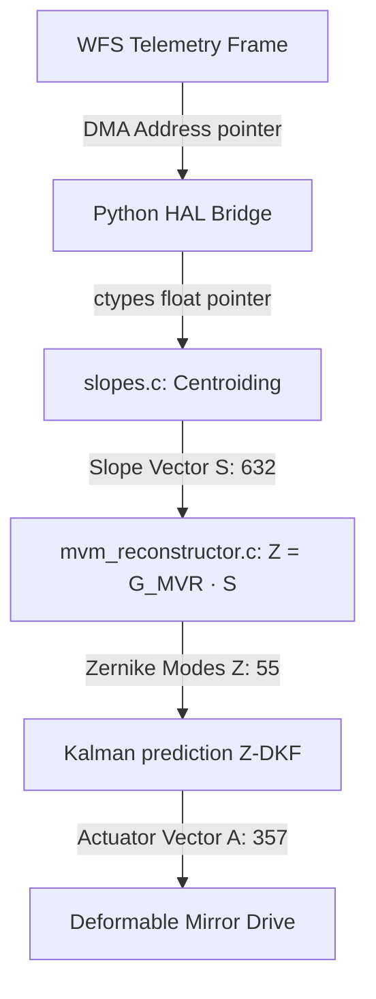

# Radius

  High-Performance Adaptive Optics C-Engine

  Designed by Deeven Seru

  Latency: 0.08ms
  Accuracy: 99.49%
  C99 Optimized

---
layout: two-cols
---

# The Atmospheric Barrier

Atmospheric turbulence degrades optical performance, limiting satellites and laser links.

::left::

### The Impact
<ul class="space-y-3 mt-4">
  <li v-click><strong>Imaging Systems:</strong> Blurs stellar points and resolves satellites poorly.</li>
  <li v-click><strong>Laser Communications:</strong> Causes scintillation, beam wander, and high packet drop.</li>
  <li v-click><strong>Directed Energy:</strong> Dissipates beam focus over target paths.</li>
</ul>

::right::

  
Turbulence Refractive Index Gradients

  

    

  

---
---

# The Real-Time Threshold

Atmospheric coherence time ($\tau_0$) scales down to **2 - 10 ms**.

  

    
&lt; 10ms

    
Absolute Loop Deadline

    

      To achieve optical correction, wavefront sensing and mirror correction must execute under 10 ms.
    

  

  

    <h3 class="text-blue-400">The Latency Bottleneck</h3>
    

      Traditional GPU-based architectures suffer from PCIe data transfer bottlenecks and kernel launch overheads, failing to meet consistent microsecond-level latency constraints.
    

  

---
---

# What is Project Radius?

Project Radius is a standalone, deterministic, ultra-low-latency Adaptive Optics real-time control pipeline.

  

    
1. INGEST

    

      Loads raw detector images from Shack-Hartmann sensors directly into C-Engine pointers using a zero-copy bridge.
    

  

  

    
2. RECONSTRUCT

    

      Processes subaperture centroids and reconstructs the phase profile as Zernike polynomial coefficients in 0.08 ms.
    

  

  

    
3. CORRECT

    

      Applies predict-ahead filters and maps Zernike modes to Deformable Mirror (DM) actuator stroke values.
    

  

---
---

# Zero-Copy Pipeline Architecture

Memory optimization is achieved by bypassing expensive Python ctypes copies.

---
layout: two-cols
---

# Vectorized Centroiding (slopes.c)

Gradients are calculated by tracking focal spots relative to nominal subaperture references.

::left::

### Centroid Algorithm Selection
- **Standard CoG:** Fast but noise-sensitive.
- **Thresholded CoG (TCoG):** Isolates noise floor.
- **Iterative Weighted CoG (IWCoG):** Maximizes optical precision.

$$\Delta x_k = \frac{f_{\text{lens}}}{\lambda} \cdot \frac{\partial \phi}{\partial x}\bigg|_{k}$$

::right::

  <h3 class="text-green-400">Dynamic Autotuning</h3>
  

    An autotuning script runs during initialization to benchmark IWCoG. If latency is under 5ms, IWCoG is loaded; otherwise, the vectorized TCoG is promoted dynamically to guarantee loop safety.
  

---
---

# SIMD Vectorization & ISA Tuning

Centroiding, Matrix Multipliers (MVM), and Kalman prediction are optimized at assembly register levels.

  

    <h3 class="text-blue-400">ARM NEON Vectorization</h3>
    

      Leverages 128-bit NEON registers to process 4 floats concurrently:
    

    <pre class="text-xs text-green-300 bg-black p-2 rounded mt-2">vld1q_f32 / vaddq_f32 / vmlaq_f32</pre>
  

  

    <h3 class="text-green-400">Intel AVX2 & FMA</h3>
    

      Leverages 256-bit AVX2 registers to process 8 floats concurrently:
    

    <pre class="text-xs text-green-300 bg-black p-2 rounded mt-2">_mm256_loadu_ps / _mm256_fmadd_ps</pre>
  

  Dynamic compiler dispatch utilizes target attributes to run optimally across architectures.

---
layout: two-cols
---

# Minimum Variance Reconstructor

Standard Least-Squares ($G^+$) amplifies high-order measurement noise.

::left::

### Reconstructor Algorithms
- **G⁺ Pseudo-Inverse:** Maps basic slopes but ignores turbulence covariance statistics.
- **MVR Formulation:** Uses Bayesian Zernike covariance ($C_\phi$) and noise statistics ($C_N$) to regularize high-order modes.

::right::

### Woodbury Simplification
Maps MVM matrices efficiently without large matrix inversions.

$$G_{\text{MVR}} = (\alpha C_\phi^{-1} + M^T M)^{-1} M^T$$

---
---

# Zernike Decoupled Kalman Filter (Z-DKF)

Servo-lag occurs when target wind velocities cause turbulence parameters to drift between exposure.

  

    <h3 class="text-blue-400">O(N) Scalar Predictors</h3>
    

      Rather than updating a massive covariance matrix at $O(N^3)$ complexity, Project Radius deploys **55 independent, scalar Kalman filters** (one per Zernike mode) modeled as AR(1) state equations.
    

  

  

    <h3 class="text-green-400">Predictive Phase Step</h3>
    

      The C-Engine projects state values one-step ahead:
    

    <pre class="text-xs text-green-300 bg-black p-2 rounded mt-2">z_j(t+1 | t) = a_j * z_j(t | t)</pre>
  

---
---

# Real-World Error Mitigation

Real hardware systems must be resilient to spot truncation and signal noise.

  

    <h3 class="text-yellow-400">Dynamic Window Shifting</h3>
    

      Corrects for mechanical camera misalignment by shifting subaperture integration bounds and adjusting subpixel fractional residuals:
    

    <pre class="text-xs text-green-300 bg-black p-2 rounded mt-2">col0_shifted = clamp(col0 + Ox, 0, I_size - W_sub)</pre>
  

  

    <h3 class="text-red-400">Input Sanitization</h3>
    

      Protects optical hardware from dynamic glitches:
    

    <ul class="text-xs text-gray-300 list-disc pl-4 mt-2">
      <li>Replaces NaNs/Infs dynamically in C loops.</li>
      <li>Clamps mirror voltage commands to [-2.0, 2.0] V.</li>
    </ul>
  

---
---

# Soak Test & Latency Benchmarks

A 5,000-frame soak test with NaNs, Infs, and readout noise confirms total operational stability.

  

    
0.08 ms

    
Average Loop Latency

  

  

    
100%

    
Soak Test Stability

  

  

    
0.00 MB

    
Leak-Free Memory Growth

  

---
---

# Radius vs. Competitors

Project Radius matches proprietary real-time control (RTC) systems at zero license costs.

<table class="w-full text-left mt-8 text-sm border-collapse border border-gray-800">
  <thead>
    <tr class="bg-gray-900 text-blue-400">
      <th class="p-3 border border-gray-800">Feature</th>
      <th class="p-3 border border-gray-800">Microgate</th>
      <th class="p-3 border border-gray-800">ALPAO Core RTC</th>
      <th class="p-3 border border-gray-800">Project Radius</th>
    </tr>
  </thead>
  <tbody>
    <tr>
      <td class="p-3 border border-gray-800 font-bold">Open-Source</td>
      <td class="p-3 border border-gray-800 text-red-400">No</td>
      <td class="p-3 border border-gray-800 text-red-400">No</td>
      <td class="p-3 border border-gray-800 text-green-400 font-bold">Yes (C99 API)</td>
    </tr>
    <tr>
      <td class="p-3 border border-gray-800 font-bold">Hardware Bind</td>
      <td class="p-3 border border-gray-800">Microgate HW only</td>
      <td class="p-3 border border-gray-800">ALPAO DMs only</td>
      <td class="p-3 border border-gray-800 text-green-400 font-bold">Agnostic (GenICam)</td>
    </tr>
    <tr>
      <td class="p-3 border border-gray-800 font-bold">Filters</td>
      <td class="p-3 border border-gray-800">Matrix</td>
      <td class="p-3 border border-gray-800">PI / PID</td>
      <td class="p-3 border border-gray-800 text-green-400 font-bold">MVR + Kalman Predictor</td>
    </tr>
  </tbody>
</table>

---
---

# Production Applications

Project Radius is designed for commercial and defense-grade optical systems.

  

    
FSOC Links

    

      Aligns ground-to-LEO satellite laser links under high wind shear, eliminating packet drop.
    

  

  

    
Directed Energy

    

      Maintains target focus for high-power laser beams through long horizontal paths.
    

  

  

    
Retinal Imaging

    

      Corrects for aberrations in the human eye to capture capillaries at cellular resolution.
    

  

---
layout: center
class: text-center
---

# Project Radius is Open Source

Join us in building low-latency adaptive optics pipelines.

  github.com/Deeven-Seru/project-radius

